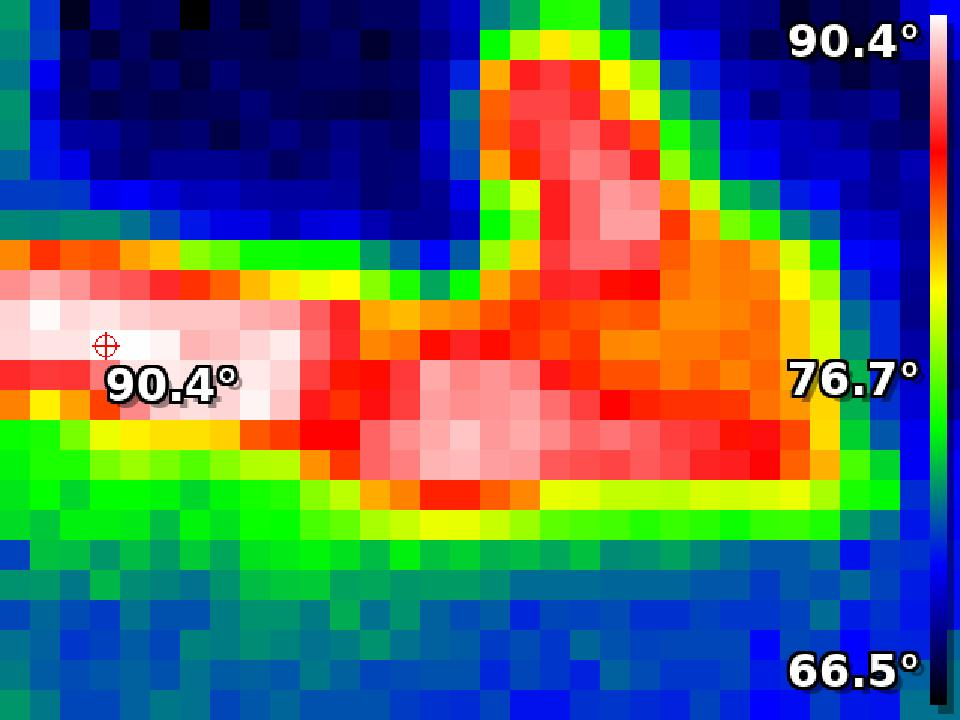

# Thermal Camera Integration for M5Stack T-Lite



A custom Home Assistant integration that visualizes thermal data from the M5Stack T-Lite device or any compatible device that provides the required JSON data format.

## Features
- Maps thermal data to a color gradient (blue, yellow, red) based on temperature.
- Includes a motion detection binary sensor based on temperature changes.
- Lightweight implementation using PIL (Pillow), optimized for Raspberry Pi and other low-resource devices.
- Designed specifically for the M5Stack T-Lite but can be adapted to other devices.

## Installation

### HACS Installation
1. Add this repository as a custom repository in HACS.
2. Search for "Thermal Camera for M5Stack T-Lite" in HACS and install it.
3. Restart Home Assistant.

### Manual Installation
1. Copy the `thermal_camera` folder to your `custom_components` directory.
2. Restart Home Assistant.

## Configuration

Add the following to your `configuration.yaml`:

````yaml
camera:
  - platform: thermal_camera
    name: "M5Stack T-Lite Thermal Camera"
    url: "http://<device-ip>"
````
Motion Detection Sensor Configuration
````yaml
binary_sensor:
  - platform: thermal_motion
    name: "M5Stack T-Lite Motion Sensor"
    url: "http://<device-ip>"
````
Replace `<device-ip>` with the actual IP address of your M5Stack T-Lite or compatible device.

## Expected URL and JSON Format

The integration expects to fetch thermal data from the URL provided in the configuration. The device should serve the data as JSON in the following format:

### Example JSON Format

````json
{
  "average": 78.7,
  "highest": 82.8,
  "lowest": 67.2,
  "frame": [
    80.2, 80.4, 83.4, 83.3, ..., 68.6, 67.8  // A 768-element array (32x24)
  ]
}
````

### JSON Fields Description

- The unit of temperature (`highest`, `lowest`, and values in `frame`) is not important to the functionality of this integration and can be provided in any consistent unit.
- **`highest`**: The highest temperature in the frame (float).
- **`lowest`**: The lowest temperature in the frame (float).
- **`frame`**: An array of 768 floating-point values representing the 32x24 thermal image frame, ordered row by row.

### Device Requirements
- The device should serve the data over HTTP.
- The endpoint must return the JSON response described above.
- The device should be accessible via a URL in the format `http://<device-ip>/json`.

## Motion Detection

The motion detection sensor calculates the difference between the "highest" and "average" temperatures in the frame. If the difference exceeds a certain threshold (default: 2.5), it indicates motion. You can adjust this threshold in the component code.

## Development

- Adjustments can be made in the camera.py code to change the font, scaling, or color mapping logic.
- For the motion detection sensor, you can customize the temperature difference threshold in the code to fine-tune sensitivity.

## Troubleshooting

If the camera feed shows a broken image, check:
- The URL is reachable and returns the expected JSON format.
- The device is correctly configured to provide 32x24 frame data.
- Review the Home Assistant logs for error messages.

For further assistance, feel free to open an issue on the GitHub repository.
